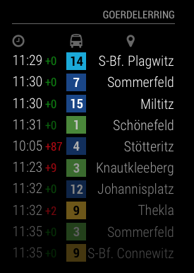
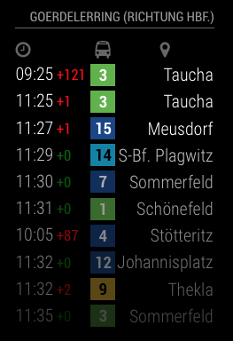

# MMM-PublicTransportHafas

MMM-PublicTransportHafas is a module for the MagicMirror project by Michael Teeuw.

[](https://codeclimate.com/github/raywo/MMM-PublicTransportHafas/maintainability)
[](https://codeclimate.com/github/raywo/MMM-PublicTransportHafas/test_coverage)

It shows live public transport information in Germany for all stations known to the Deutsche Bahn system. Most public transportation providers in Germany providing information for that system so the coverage should be quite good. The data is provided by the most beautiful [hafas-client](https://github.com/derhuerst/hafas-client) by [Jannis Redmann (derhuerst)](https://github.com/derhuerst). Even in other european contries this module should work as HAFAS is widely used throughout Europe.

This module is intended to replace [MMM-PublicTransportLeipzig](https://github.com/raywo/MMM-PublicTransportLeipzig) since it uses the very unrealiable data provided by the LVB (Leipziger Verkehrsbetriebe). Thus the colors for the tram lines match the pattern used in Leipzig. But you can very easy adapt that to your needs. See [Providing a custom css file](#providing-a-custom-css-file).


## How it works

After you installed MMM-PublicTransportHafas you just configure it to your needs and that’s it. The only config you really need to set is the stationID property. This determines the station you want to display. Everything else is covered by defaults but can be configured by you anyway. For instance you can enter a time you need to get to the station (`timeToStation` in config). The module then only shows departures you can reach respecting the set time.

For more information see the [Configuration](#configuration) section.


## Screenshots

|<br>*Leipzig, Goerdelerring (all directions)*|<br>*Leipzig, Goerdelerring (heading to main station)*|
|---|---|
|<br>*Hauptbahnhof, Leipzig (displaying only trams and two unreachable departures)*|<br>*Hauptbahnhof, Leipzig (displaying only regional and national trains)*|


## Preconditions

* MagicMirror<sup>2</sup> instance
* Node.js version >= 7
* npm


## Installing

Just clone the module into your MagicMirror modules folder and execute `npm install` in the module’s directory:

```bash
git clone https://github.com/raywo/MMM-PublicTransportHafas.git
cd MMM-PublicTransportHafas
npm install
```


## Updating

Go to the module’s folder inside MagicMirror modules folder and pull the latest version from GitHub and install:

```bash
git pull
npm install
```


## How to get the `stationID`

For your convenience a script to query the hafas system for a `stationID` is included. The script is located in the `convenience` folder inside the module’s folder. Run the script and enter the station name. It is useful to enter a city name too since the system knows a lot of stations even outside Germany. 

Running the script:

change to `MagicMirror/modules/MMM-PublicTransportHafas`

```bash 
node ./convenience/query_station.js 
```

The following example shows a query for "Leipzig, Wilhelm-Leuschner-Platz". This station is included two times in the result. You have to experiment which ID gives the best results.

```
Geben Sie eine Adresse oder einen Stationsnamen ein: Leipzig, Wilhelm-Leuschner-Platz

Gefundene Haltestellen für "Leipzig, Wilhelm-Leuschner-Platz":

> Haltestelle: "Leipzig Wilhelm-Leuschner-Platz"
  ID: 008012202
  Verkehrsmittel: S-Bahn, Bus, Tram

> Haltestelle: "Wilhelm-Leuschner-Platz, Leipzig"
  ID: 000955252
  Verkehrsmittel: Bus, Tram

> Haltestelle: "Wilhelm-Leuschner-Platz, Weiterstadt"
  ID: 000115849
  Verkehrsmittel: Bus

> Haltestelle: "Wilhelm-Liebknecht-Platz, Leipzig"
  ID: 000956558
  Verkehrsmittel: Bus, Tram
``` 


## Configuration

The module is quite configurable. These are the possible options:

| Option | Description |
|--------|-------------|
| `stationID`                       | <p>The ID you want to display departures for.</p><p>**Type:** `string` **REQUIRED**<br>**Example:** `"008012202"`<br>**Default Value:** none</p><p>**Note:** How to get the ID is described [here](#how-to-get-the-stationID)</p>|
| `stationName`                     | <p>The name of the station as it should appear on the display.</p><p>**Type:** `string` **OPTIONAL**<br>**Example:** `"Wilhelm-Leuschner-Platz"`<br>**Default Value:** none</p><p>**Note:** If you leave this setting, `headerPrefix` and `headerAppendix` blank the module will show an empty header.</p>|
| `headerPrefix`                    | <p>The text to be prepended to the `stationName`.</p><p>**Type:** `string` **OPTIONAL** <br>**Example:** `"von"`<br>**Default Value:** `""`</p><p>**Note:** A blank between `headerPrefix` and `stationName` is automatically inserted.</p>|
| `headerAppendix`                  | <p>The text to be prepended to the `stationName`.</p><p>**Type:** `string` **OPTIONAL** <br>**Example:** `"(Richtung HBF)"`<br>**Default Value:** `""`</p><p>**Note:** A blank between `headerAppendix` and `stationName` is automatically inserted.</p>|
| `updatesEvery`                    | <p>The time in seconds when the displayed departures should be updated.</p><p>**Type:** `integer` **OPTIONAL** <br>**Example:** `60` (The departures will be refreshed every minute.)<br>**Default Value:** `120`</p><p>**Note:** The minimal refresh time is 30 seconds.</p>|
| `direction`                       | <p>An ID of a station. It is used to display only those departures heading to this station. </p><p>**Type:** `string` **OPTIONAL**<br>**Example:** `"000954609"`<br>**Default Value:** `""`</p><p>**Note:** It is not neccessary to find the ID of the end station. Just use the next station which is on the route you are after.<br>It is not possible to list multiple IDs. If you want to display different directions for one station use multiple instances of this module.</p>|
| `ignoredLines`                    | <p>An array of strings describing the lines you want to exclude from the displayed departures.</p><p>**Type:** `array` **OPTIONAL** <br>**Example:** `[ "STR 11", "STR 10" ]` (Displays all lines except tram 10 and 11.)<br>**Default Value:** `[]`</p><p>**Note:** You need to provide the line name exactly as they are otherwise displayed. This setting is case sensitive. Blanks need to be exactly as they are display. If a line is usually displayes as `BUS  89` (two blanks) you need to type exactly that into the array with two blanks. </p>|
| `excludedTransportationTypes`     | <p>An array of strings describing the transportation types you want to exclude from the displayed departures.</p><p>**Type:** `array` **OPTIONAL** <br>**Example:** `[ "suburban", "bus" ]`<br>**Default Value:** `[]`</p><p>**Note:** Possible values are: <table><tr><th>Type</th><th>Use in Germany</th></tr><tr><td>`"bus"`</td><td>bus</td></tr><tr><td>`"ferry"`</td><td>F&auml;hre</td></tr><tr><td>`"express"`</td><td>?</td></tr><tr><td>`"national"`</td><td>IC trains</td></tr><tr><td>`"nationalExp"`</td><td>ICE trains</td></tr><tr><td>`"regional"`</td><td>RB or RE</td></tr><tr><td>`"suburban"`</td><td>S-Bahn</td></tr><tr><td>`"subway"`</td><td>U-Bahn</td></tr><tr><td>`"tram"`</td><td>Tram</td></tr><tr><td>`"taxi"`</td><td>Taxi</td></tr></table></p>|
| `timeToStation`                   | <p>An integer indicating how long it takes you to get to the station.</p><p>**Type:** `integer` **OPTIONAL**<br>**Example:** `5`<br>**Default Value:** `10` </p><p>**Note:** The time is given in minutes.</p>|
| `timeInFuture`                    | <p>An integer indication how far in the future a departure can be.</p><p>**Type:** `integer` **OPTIONAL** <br>**Example:** `60`<br>**Default Value:** `10`</p><p>**Note:** The time is given in minutes.<br>Use this setting on stations where there is a big time gap between departures. This way you will see more than one or two departures.</p>|
| `marqueeLongDirections`           | <p></p><p>**Type:** <br>**Example:** <br>**Default Value:** </p><p>**Note:** </p>|
| `showColoredLineSymbols`          | <p></p><p>**Type:** <br>**Example:** <br>**Default Value:** </p><p>**Note:** </p>|
| `useColorForRealtimeInfo`         | <p></p><p>**Type:** <br>**Example:** <br>**Default Value:** </p><p>**Note:** </p>|
| `showTableHeaders`                | <p></p><p>**Type:** <br>**Example:** <br>**Default Value:** </p><p>**Note:** </p>|
| `showTableHeadersAsSymbols`       | <p></p><p>**Type:** <br>**Example:** <br>**Default Value:** </p><p>**Note:** </p>|
| `maxUnreachableDepartures`        | <p></p><p>**Type:** <br>**Example:** <br>**Default Value:** </p><p>**Note:** </p>|
| `maxReachableDepartures`          | <p></p><p>**Type:** <br>**Example:** <br>**Default Value:** </p><p>**Note:** </p>|
| `fadeUnreachableDepartures`       | <p></p><p>**Type:** <br>**Example:** <br>**Default Value:** </p><p>**Note:** </p>|
| `fadeReachableDepartures`         | <p></p><p>**Type:** <br>**Example:** <br>**Default Value:** </p><p>**Note:** </p>|
| `fadePointForReachableDepartures` | <p></p><p>**Type:** <br>**Example:** <br>**Default Value:** </p><p>**Note:** </p>|
| `customLineStyles`                | <p></p><p>**Type:** <br>**Example:** <br>**Default Value:** </p><p>**Note:** </p>|
| `showOnlyLineNumbers`             | <p></p><p>**Type:** <br>**Example:** <br>**Default Value:** </p><p>**Note:** </p>|


Here is an example for an entry in `config.js`

```javascript
{
  stationID: "008012202",                   // Replace with your stationID!
  stationName: "Wilhelm-Leuschner-Platz"    // Replace with your station name!
  
  direction: "",                    // Show only departures heading to this station. (A station ID.)
  ignoredLines: [],                 // Which lines should be ignored? (comma-separated list of line names)
  excludedTransportationTypes: [],  // Which transportation types should not be shown on the mirror? (comma-separated list of types) possible values: StN for tram, BuN for bus, s for suburban
  timeToStation: 10,                // How long do you need to walk to the next Station?
  timeInFuture: 10,                 // Show departures for the next *timeInFuture* minutes.

  showColoredLineSymbols: true,     // Want colored line symbols?
  useColorForRealtimeInfo: true,    // Want colored real time information (timeToStation, early)?
  showTableHeadersAsSymbols: true,  // Table Headers as symbols or text?
  maxUnreachableDepartures: 0,      // How many unreachable departures should be shown?
  maxReachableDepartures: 7,        // How many reachable departures should be shown?
  customLineStyles: "leipzig",      // Prefix for the name of the custom css file. ex: Leipzig-lines.css (case sensitive)
  showOnlyLineNumbers: false        // Display only the line number instead of the complete name, i. e. "11" instead of "STR 11"
},  
```


## Notes

It is possible to use multiple instances of this module even using the same `stationID`. So you can display in one instance something like “main station heading eastbound” and in another instance “main station heading westbound”

## Providing a custom css file
